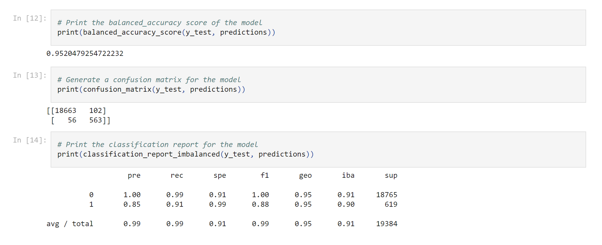
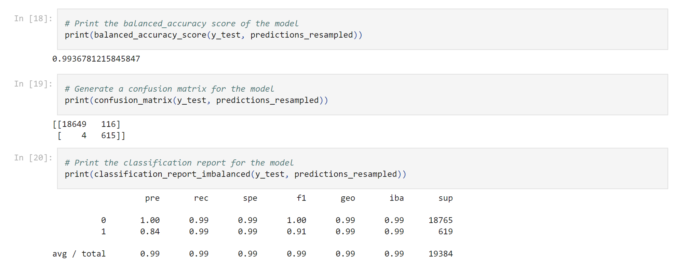

# Credit Risk Analysis Report

## Overview of the Analysis

In this analysis, classification machine learning models were used to predict a binary outcome related to the risk classification of a loan. The classification model provided a prediction on whether a loan was healthy (low-risk) or unhealthy (high-risk).  

The financial information provided lending data which included loan size, interest rate, borrower income, debt-to-income ratio, derogatory marks, total debt, and number of accounts.

As part of this analysis, the following stages of the machine learning proess were leveraged:
 - Data Collection
 - Data Preprocessing
 - Feature Engineering
 - Label Generation
 - Model Selection
 - Model Training
 - Model Evaluation
 - Model Deployment

Below provides basic information about the variables being predicted (e.g., value_counts):
```bash
# Check the balance of our target values
y.value_counts()
0    75036
1     2500
Name: loan_status, dtype: int64
```

The Machine Learning model that was used was the Logistic Regression Classifer, which is a widely used statistical method for binary classification problems.   

## Results

Below describes the balanced accuracy scores and the precision and recall scores of all the machine learning models leveraged.

* Machine Learning Model 1: Logistic Regression Classifer (fitted with imbalanced data)
  * Description of Model 1 Accuracy, Precision, and Recall scores.



    * For healthy loans, the model achieved a precision score (accuracy of positive predictions) of 1 meaning it correctly predicts a loan as healthy 100% of the time. The model has a recall (true positive rate) of .99 meaning that it correctly identifies 99% of the healthy loans. The model has a specificity of .91 meaning that it correctly identifies 91% of the actual high-risk loans as high-risk. The F1 score (harmonic mean of precision and recall) is 1.00 which is a balanced measure of precision and recall.


* Machine Learning Model 2: Logistic Regression Classifer (fitted with balanced/resampled data)
  * Description of Model 2 Accuracy, Precision, and Recall scores.



    * The logistic regression model, fit with resampled data, saw in improvement in the recall (from 91% to 99%) for high-risk loans. This is a significant improvement which is important for the company as they are focused on trying to identify individuals with high credit risk.


## Summary

Accuracy is imperative when dealing with classification of credit risk and it may end up being costly to a lending company if a model predicts incorrect results for high-risk loans that end up defaulting. Based on the analysis and the results presented above, the Logistic Regression Classifier model fitted with resampled data out-performed the model fitted with imbalanced data.  This is because the model with the balanced data generated a higher accuracy and recall score.  

Based on this, Model 2, the Logistic Regression Classifer Model fitted with balanced resampled data is preferred.

